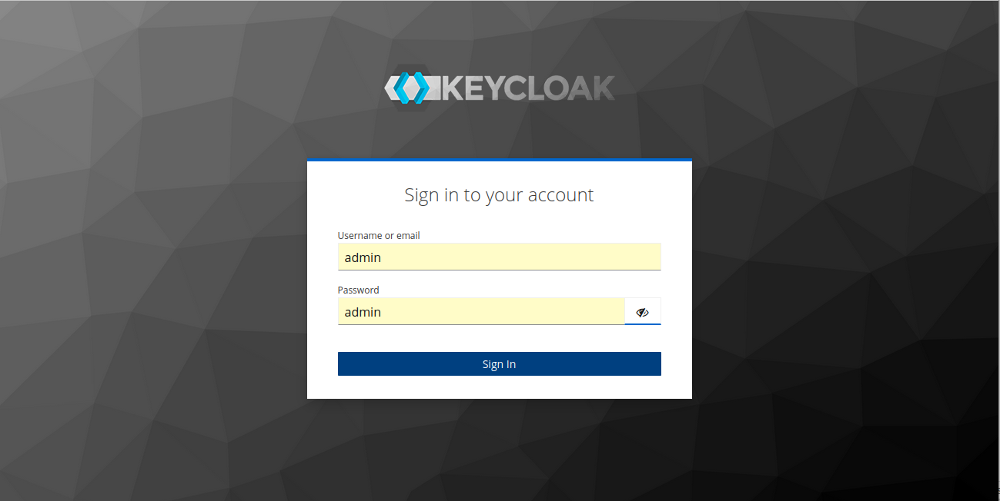
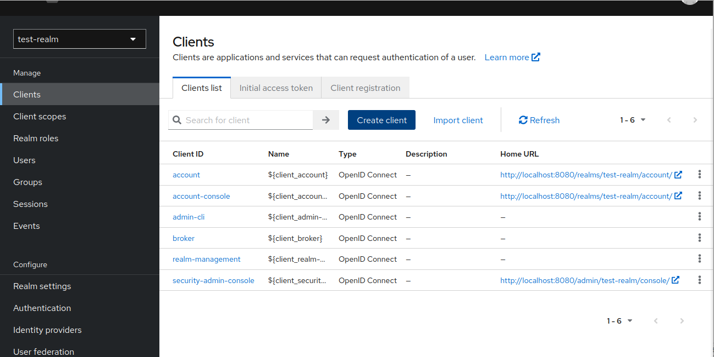
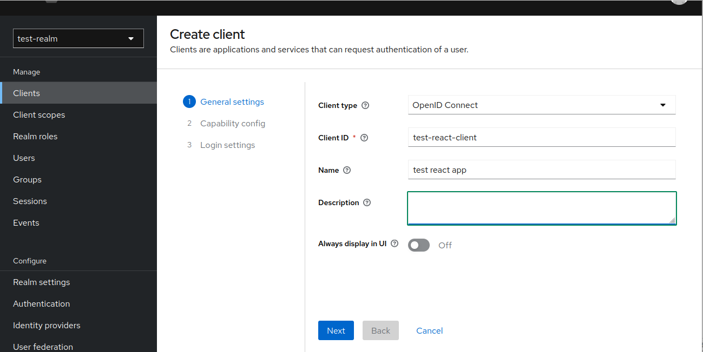
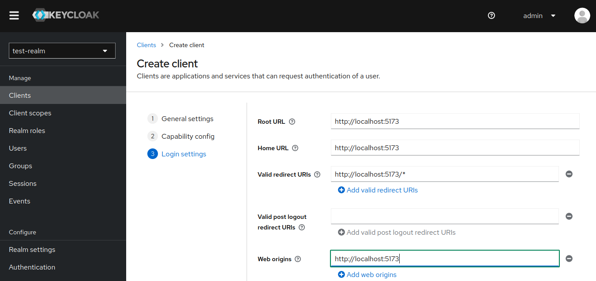

In the browser: type the following

```
    http://localhost:8080
```

Enter the admin credentials and log in -Eg: `{admin, admin}`



click on `keycloak` select menu then select `test-realm` we created earlier, then

click on `Clients` --> `Create client`





since the vite-react default host address is `http://localhost:5173`



then click on `save`

### Now lets make changes to the react project.

Install `keycloak-js` and `@react-keyclock/web` in the reactapp directory

```
    npm i --save keycloak-js
    npm i --save @react-keyclock/web
```

add a file for keycloak instance `src/helpers/keycloak.ts`

```ts
import Keycloak from "keycloak-js";

const keycloakOptions = {
  url: "http://localhost:8080",
  realm: "test-realm",
  clientId: "test-react-client",
};

const keycloak = new Keycloak(keycloakOptions);

export default keycloak;
```
`TODO:` above code can be separated to the .env  file 

update the code at `src/main.tsx` to initialise keycloak so without login app is inaccessible

```ts
import ReactDOM from "react-dom/client";
import { ReactKeycloakProvider } from "@react-keycloak/web";
import keycloakInstance from "./helpers/keycloak";

ReactDOM.createRoot(document.getElementById("root")!).render(
  <ReactKeycloakProvider
    authClient={keycloakInstance}
    initOptions={{ onLoad: "login-required" }}
  >

   {---your previous code---}

  </ReactKeycloakProvider>
);
```

Now we can access keycloak from anywhere in the app as following,

```ts
    import { useKeycloak } from "@react-keycloak/web";

    export default function ExampleComponent() {
        const {keycloak} = useKeycloak();
        return (
            <>
               {keycloak && keycloak.authenticated ? 
               ( <p>{keycloak.tokenParsed?.given_name} is logged in</p> ):(
                <p>not logged in</p>
               )}
            </>
        )};
```


