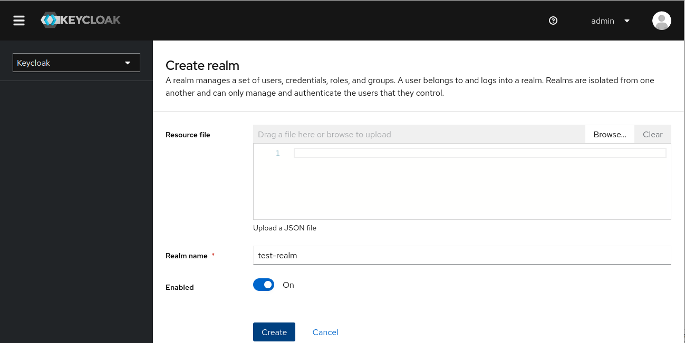
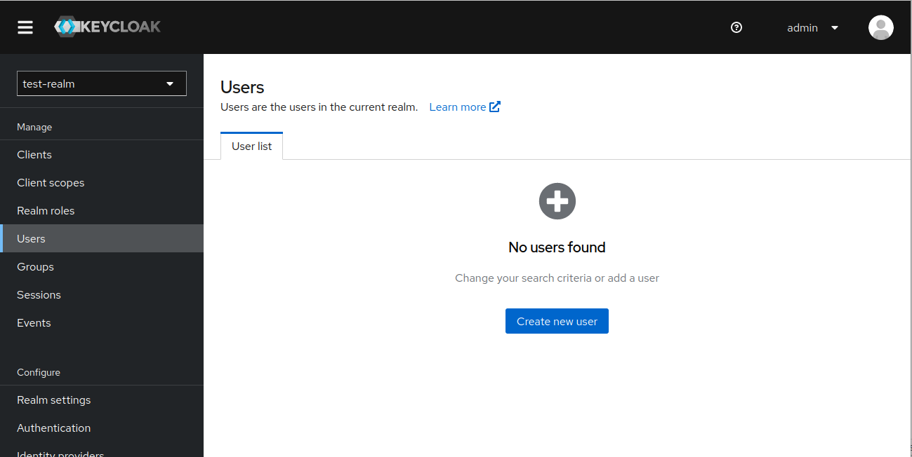
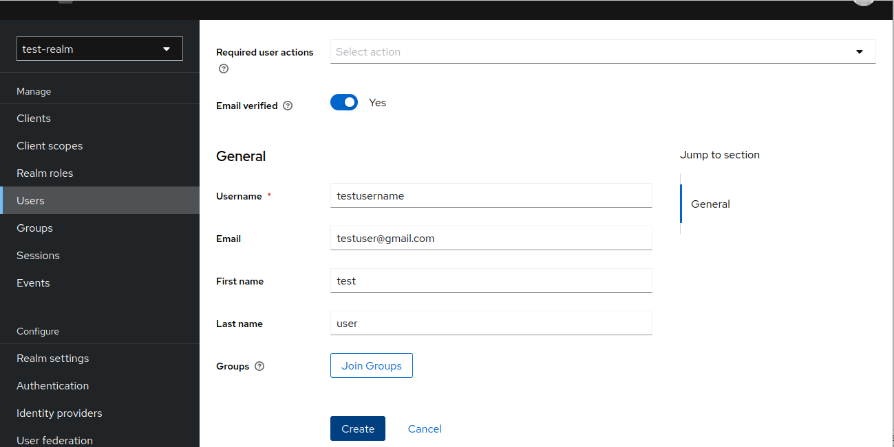
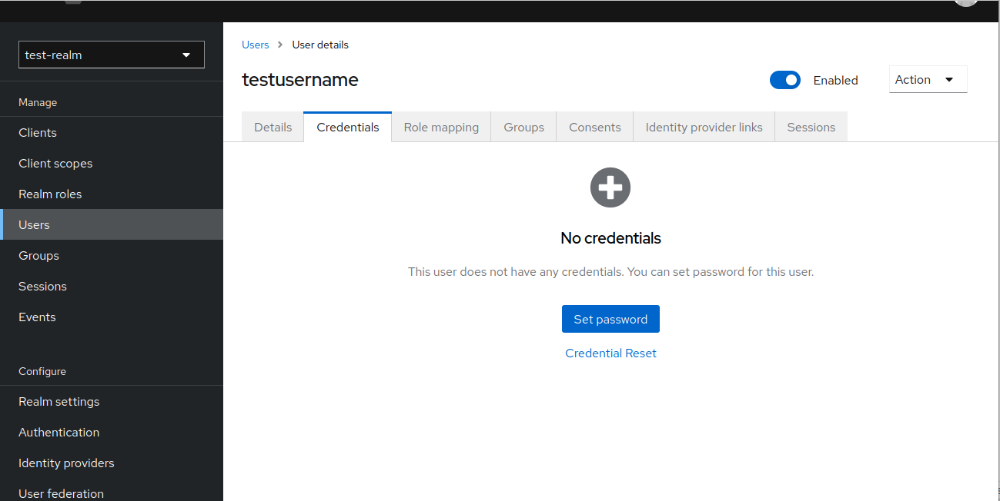
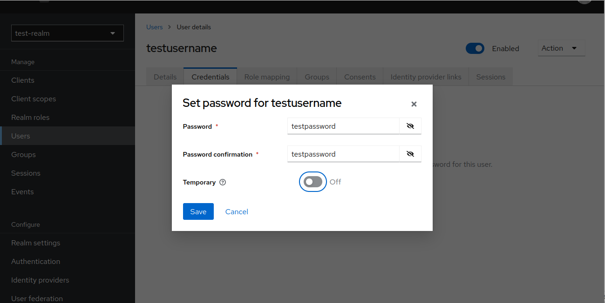
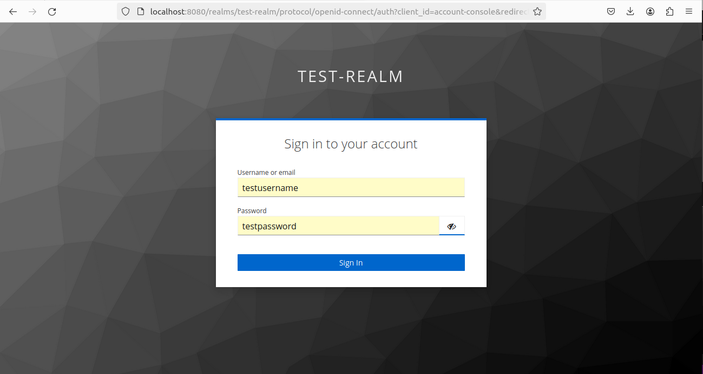
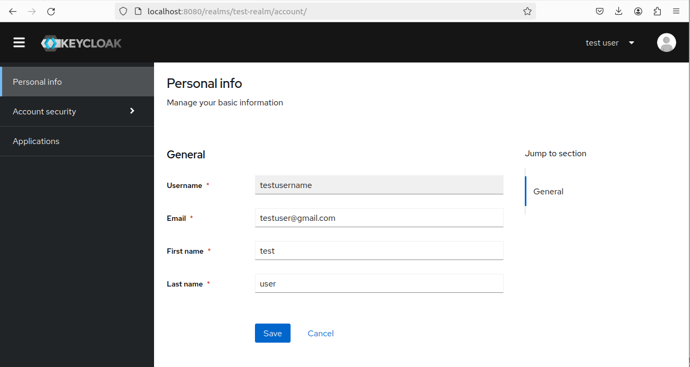

After writing `docker-compose.yml` file
```docker

version: '3.7'

services:

  keycloak:
    image: quay.io/keycloak/keycloak:24.0.3
    ports:
      - "8080:8080"
    environment:
      - KEYCLOAK_ADMIN=admin
      - KEYCLOAK_ADMIN_PASSWORD=admin
    command: ["start-dev"]
    
```

From the terminal run following command and press `enter`

```
    sudo docker-compose up -d
```
In the browser: type the following
```
    http://localhost:8080
```
Enter the admin credentials and log in -Eg: `{admin, admin}`


create a new realm  -Eg:  `test-realm `

click on `keycloak` select menu then click on `create realm`



create a new user inside that realm  -Eg: `testusername`

click on `Users` --> `create new user`  





setup the password for that user   -Eg: `testpassword`

click on `Credentials` --> ` set password `  





Goto 
```
    http://localhost:8080/realms/test-realm/account/
```
in the browser type 
```
    testusername

    testpassword
```

 as below and click on `Sign In`



if setup is successful then,



Now we are ready to connect keycloak to the react.